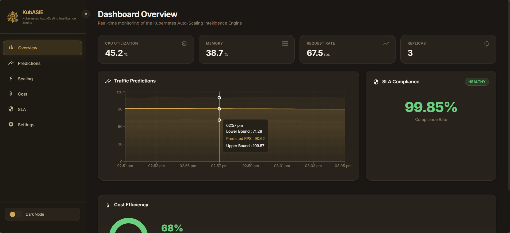
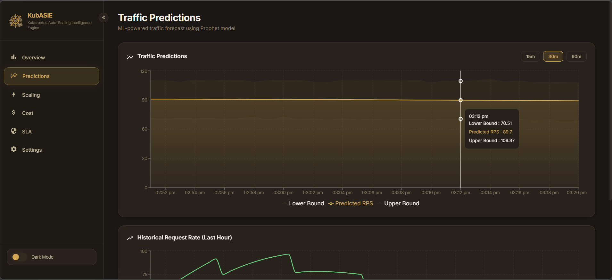
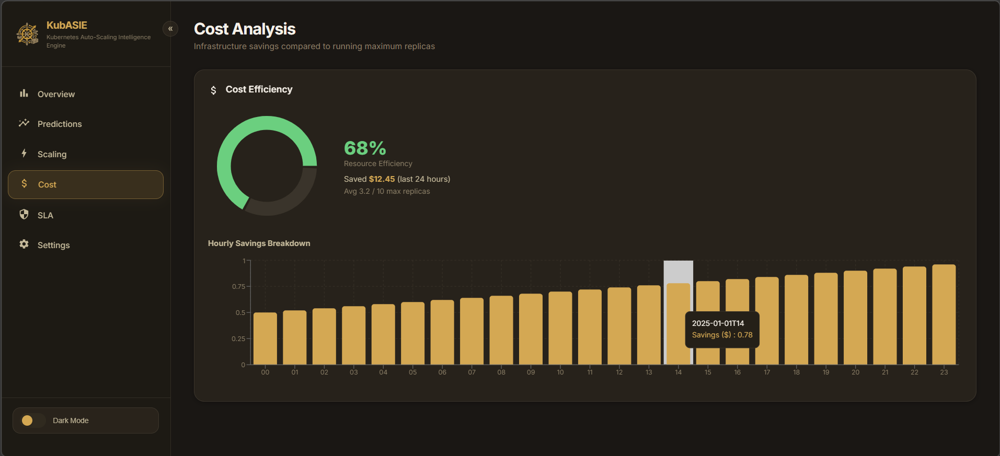

# 🚀 Kubernetes Auto-Scaling Intelligence Engine

[](https://github.com/Ashish241/KubASIE/actions)
[](https://python.org)
[](https://kubernetes.io)
[](LICENSE)

An intelligent auto-scaling system that **predicts traffic patterns** using Machine Learning, **dynamically adjusts Kubernetes HPA scaling rules**, and **reduces infrastructure costs** while maintaining SLA guarantees.

<div align="center">
  
</div>

### 🔮 Machine Learning Predictions
KubASIE uses advanced time-series forecasting (Prophet & LSTM) to predict future resource spikes before they happen.
<div align="center">
  
</div>

### 💰 Cost & Resource Optimization
Track your compute savings and exact scaling decisions dynamically.
<div align="center">
  
</div>

## ✨ Key Features

| Feature | Description |
|---------|-------------|
| 🔮 **Predictive Scaling** | LSTM & Prophet models forecast traffic 15-60 minutes ahead |
| ⚡ **Hybrid Policy Engine** | Combines reactive thresholds with ML predictions |
| 💰 **Cost Optimization** | Tracks savings vs. max-replicas baseline |
| 🛡️ **SLA Monitoring** | Real-time compliance tracking with alerts |
| 📊 **REST API** | FastAPI with auto-generated Swagger docs |
| 🐳 **Fully Containerized** | Docker + Kubernetes + Helm ready |
| 🧪 **Comprehensive Tests** | Unit tests for every component |
| 🔄 **CI/CD Pipeline** | GitHub Actions with lint, test, build |

## 🏗️ Architecture

```
┌──────────────┐     ┌──────────────┐      ┌──────────────────┐
│  Target App  │────▶│  Prometheus  │────▶│ Metrics Collector│
│  (Flask)     │     │              │      │ (→ InfluxDB)     │
└──────┬───────┘     └──────────────┘      └────────┬─────────┘
       │                                           │
       │  ┌──────────────────────────────────────┐ │
       │  │         ML Predictor                 │ │
       │  │  (Prophet + LSTM Traffic Forecast)   │◀┘
       │  └────────────────┬─────────────────────┘
       │                   │
       │  ┌────────────────▼─────────────────────┐
       │  │         Scaling Engine               │
       │  │  (Hybrid Policy + K8s Controller)    │
       │  │  (Cost Optimizer + SLA Monitor)      │
       │  └────────────────┬─────────────────────┘
       │                   │
       ▼                   ▼
  ┌─────────┐      ┌─────────────┐       ┌──────────┐
  │ K8s HPA │◀─────│  REST API   │◀─────│ Dashboard│
  │(Patched)│      │  (FastAPI)  │       │ (React)  │
  └─────────┘      └─────────────┘       └──────────┘
```

## 📁 Project Structure

```
├── target-app/          # Flask workload with Prometheus metrics
├── metrics-collector/   # Prometheus → InfluxDB pipeline
├── ml-predictor/        # Prophet + LSTM traffic prediction
├── scaling-engine/      # Hybrid policy + K8s HPA controller
├── api-server/          # FastAPI REST API (15+ endpoints)
├── dashboard/           # React dashboard (Vite + Recharts)
├── helm/                # Helm chart for one-command deployment
├── infra/               # K8s manifests, Prometheus, InfluxDB, Grafana
├── load-testing/        # Locust traffic simulation
├── .github/workflows/   # CI/CD pipeline (lint + test + docker build)
└── docker-compose.yml   # Local development environment
```

## 🚀 Quick Start

### Prerequisites

| Requirement | Version | Notes |
|-------------|---------|-------|
| **Git** | Any | To clone the repository |
| **Docker Desktop** | 4.x+ | Must be **running** before starting |
| **Docker Compose** | v2+ | Included with Docker Desktop |
| **Node.js** | 20+ | Only needed for dashboard dev mode (optional) |

> **Windows Users:** Make sure Docker Desktop is set to use **Linux containers** (default). WSL 2 backend is recommended for better performance.

### Clone & Run (First Time)

```bash
# 1. Clone the repo
git clone https://github.com/Ashish241/KubASIE.git
cd k8s-autoscaling-engine

# 2. Build and start all services (first build takes ~10 min for ML dependencies)
docker-compose up --build -d

# 3. Wait for all services to become healthy (~60-90 seconds)
docker-compose ps

# 4. Train the ML models (required on first run)
docker exec ml-predictor python train.py --source synthetic --days 7

# 5. Restart ml-predictor to load the trained models
docker restart ml-predictor

# 6. Open the dashboard
#    http://localhost:3000
```

> **Note:** Step 4-5 only need to be run on first setup or after running `docker-compose down -v` (which deletes data volumes). The trained models are persisted in a Docker volume and survive normal `docker-compose down` / `docker-compose up` cycles.

### Starting After Docker Desktop Restart

If you've restarted Docker Desktop or your computer, follow these steps:

```bash
# 1. Open a terminal in the project folder
cd "c:\My Projects\KubASIE"

# 2. Clean up any orphaned containers (prevents name conflicts)
docker container prune -f

# 3. Start all services in detached mode
docker-compose up -d

# 4. Verify all 9 containers are running and healthy
docker-compose ps

# 5. Open the dashboard
#    http://localhost:3000
```

> **If the dashboard shows "ML Predictor service is unreachable" or "prophet model is not trained"**, retrain the models:
> ```bash
> docker exec ml-predictor python train.py --source synthetic --days 7
> docker restart ml-predictor
> ```
> Then refresh the dashboard after ~30 seconds.

### Service URLs

Once all containers are **healthy**, these URLs are available:

| Service | URL | Description |
|---------|-----|-------------|
| **Dashboard** | http://localhost:3000 | React monitoring UI |
| **API Server** (Swagger) | http://localhost:8000/docs | Interactive API documentation |
| **API Server** (Health) | http://localhost:8000/health | API health check |
| **Prometheus** | http://localhost:9090 | Metrics database |
| **InfluxDB** | http://localhost:8086 | Time-series storage |
| **Grafana** | http://localhost:3001 | Optional dashboards (admin/admin) |
| **Target App** | http://localhost:5000/health | Sample workload |
| **ML Predictor** | http://localhost:8001 | ML prediction service |

### Stop & Clean Up

```bash
# Stop all services (keeps data volumes including trained models)
docker-compose down

# Stop and delete all data volumes (full reset — will need to retrain models)
docker-compose down -v
```

### Dashboard Dev Mode (Optional)

If you want to develop the dashboard with hot-reload:

```bash
cd dashboard
npm install
npm run dev    # Opens at http://localhost:5173
```

> **Note:** In dev mode, the Vite proxy forwards `/api` calls to `http://localhost:8000`. Make sure the API server is running (either via Docker or locally).

### 🛠️ Troubleshooting

| Problem | Solution |
|---------|----------|
| **Container name conflict** | Run `docker container prune -f` to remove orphaned containers, then `docker-compose up -d` |
| **ML Predictor 503 / unreachable** | Wait ~60 seconds after startup for health checks. If persistent, retrain: `docker exec ml-predictor python train.py --source synthetic --days 7` then `docker restart ml-predictor` |
| **"prophet model is not trained"** | Run `docker exec ml-predictor python train.py --source synthetic --days 7` then `docker restart ml-predictor` |
| **Containers keep restarting** | Run `docker-compose logs <service-name>` to check errors |
| **ml-predictor build fails** | Ensure Docker has ≥4 GB RAM allocated (Settings → Resources) |
| **Port already in use** | Stop any local services using ports 3000, 5000, 8000, 8001, 8086, 9090, 3001 |
| **Dashboard shows API errors** | Wait ~90 seconds for all services to be healthy, then refresh |
| **First build is very slow** | Normal — PyTorch + CmdStan install takes ~10 min. Subsequent builds use cache |
| **`docker-compose` not found** | Use `docker compose` (without hyphen) on Docker Compose v2 |


### Kubernetes Deployment (Helm)

```bash
# One-command deployment with Helm
helm install autoscale-engine ./helm/autoscale-engine

# Or with custom values
helm install autoscale-engine ./helm/autoscale-engine \
  --set targetApp.replicas=3 \
  --set dashboard.service.nodePort=30081

# Verify
kubectl get pods -n autoscaler
```

### Kubernetes Deployment (Manual)

```bash
# Create namespace
kubectl apply -f infra/namespace.yaml

# Deploy infrastructure
kubectl apply -f infra/prometheus/
kubectl apply -f infra/influxdb/

# Deploy application services
kubectl apply -f target-app/k8s/
kubectl apply -f infra/api-server/
kubectl apply -f infra/ml-predictor/
kubectl apply -f infra/metrics-collector/
kubectl apply -f infra/dashboard/

# Verify
kubectl get pods -n autoscaler
```

### Run Tests

```bash
# Install test dependencies
pip install pytest pytest-cov pytest-asyncio

# Run all component tests
cd metrics-collector && python -m pytest tests/ -v
cd ../scaling-engine && python -m pytest tests/ -v
cd ../api-server && python -m pytest tests/ -v
cd ../ml-predictor && python -m pytest tests/ -v
```

### Train ML Model

```bash
cd ml-predictor

# Install dependencies
pip install -r requirements.txt

# Train with synthetic data (for development)
python train.py

# Evaluate model
python evaluate.py
```

### Load Testing

```bash
cd load-testing
pip install -r requirements.txt
locust -f locustfile.py --headless -u 50 -r 5 --run-time 10m --host http://localhost:5000
```

## 📡 API Endpoints

| Method | Endpoint | Description |
|--------|----------|-------------|
| GET | `/api/predictions?horizon=15` | Traffic predictions |
| GET | `/api/metrics/current` | Current cluster metrics |
| GET | `/api/metrics/history` | Historical metrics |
| GET | `/api/scaling/status` | HPA status |
| GET | `/api/scaling/history` | Scaling event log |
| POST | `/api/scaling/override` | Manual scaling |
| GET | `/api/cost/summary` | Cost savings report |
| GET | `/api/sla/status` | SLA compliance |
| PUT | `/api/settings` | Update thresholds |

Full Swagger docs at: `http://localhost:8000/docs`

## 🧠 ML Models

### Facebook Prophet
- Captures daily/weekly seasonality
- Handles holidays and anomalies
- Best for: stable, periodic traffic patterns

### LSTM (PyTorch)
- Deep learning sequence-to-sequence model
- Multi-feature input with temporal encoding
- Best for: complex, non-linear traffic patterns

### Evaluation
- Walk-forward backtesting (no data leakage)
- Metrics: MAE, RMSE, MAPE
- Model comparison framework included

## 🛡️ Scaling Policies

1. **Reactive** — Scales based on current CPU/memory/RPS thresholds
2. **Predictive** — Pre-scales based on ML traffic predictions
3. **Hybrid** _(default)_ — Weighted combination with anti-flapping cooldown

## 🛠️ Tech Stack

| Layer | Technology |
|-------|-----------|
| Application | Python, Flask, FastAPI |
| ML | Prophet, PyTorch (LSTM), scikit-learn |
| Infrastructure | Kubernetes, Docker, Prometheus |
| Storage | InfluxDB 2.x |
| Visualization | Grafana, React (dashboard) |
| CI/CD | GitHub Actions |
| Package Manager | Helm 3 |
| Load Testing | Locust |

## 🖥️ Dashboard

The React dashboard provides real-time monitoring of all services with a **dark/light beige-themed** UI.

**Pages:** Overview · Predictions · Scaling · Cost · SLA · Settings

```bash
cd dashboard
npm install
npm run dev    # Opens at http://localhost:5173
```

## ☸️ Helm Chart

The `helm/autoscale-engine/` chart lets you deploy the entire stack in one command:

```bash
helm install autoscale-engine ./helm/autoscale-engine
helm upgrade autoscale-engine ./helm/autoscale-engine --set apiServer.replicas=2
helm uninstall autoscale-engine
```

Configurable via `values.yaml`: image tags, replica counts, resource limits, service types, and node ports.

## 📄 License

MIT License — see [LICENSE](LICENSE) for details.